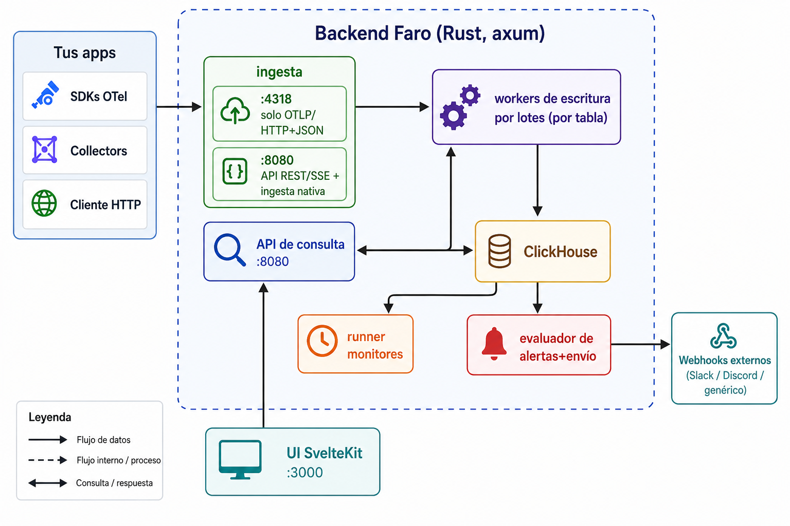

# Faro

Plataforma centralizada de observabilidad — logs, trazas, métricas, agrupación de errores, monitoreo de disponibilidad de APIs y alertas basadas en umbrales — todo en un único stack auto-hospedado.

Inspirada en Monoscope y proyectos similares, pero construida sobre un stack más pequeño y opinado:

| Capa         | Tecnología                            |
| ------------ | ------------------------------------- |
| Almacenamiento | ClickHouse 24.x                     |
| Backend      | Rust (axum, tokio, reqwest)           |
| Ingesta      | OTLP/HTTP+JSON, OTLP/gRPC + HTTP/JSON nativo |
| Frontend     | SvelteKit (Svelte 4) + CSS plano      |
| Cola/caché   | Redis (reservado para uso futuro)     |
| Despliegue   | Docker Compose                        |

## Qué incluye

- **Logs** — logs estructurados de alta cardinalidad con búsqueda de texto completo, filtros por severidad y servicio, live tail (SSE) y retención de 30 días.
- **Tracing distribuido** — ingesta de spans OTLP, listado de trazas, vista en cascada de spans y retención de 14 días.
- **Métricas** — gauges, counters, sums, histogramas y summaries vía OTLP, con agregaciones al vuelo (avg/sum/min/max/count) y bucketing por tiempo, retención de 90 días.
- **Agrupación de errores** — huella digital automática de logs WARN+/ERROR en issues estilo Sentry con flujo de resolver/ignorar.
- **Monitores de API** — chequeos HTTP sintéticos en intervalos configurables con estadísticas de uptime% y latencia.
- **Reglas de alerta** — queries declarativas de ClickHouse con umbral + ventana, disparo/resolución automática de incidentes, notificaciones por webhook (Slack/Discord/genérico).
- **Product analytics** — eventos de producto, funnels, cohorts, sesiones y usuarios multi-device sobre `faro.product_events`.
- **Feature flags y experimentos** — evaluación local en SDKs, exposures `$feature_exposure`, A/B testing con p-value/CI y rollback recomendado cuando treatment sube errores.
- **Dashboard** — totales, sparkline del volumen de logs, vista general de servicios.

> Documentación completa en [`docs/`](docs/README.md): guías, ADR y la referencia generada de variables de entorno.

## Arranque rápido

```bash
cp .env.example .env             # ajusta puertos / token si lo deseas
docker compose up -d --build
```

Cuando todo esté saludable:

| Servicio       | URL                       |
| -------------- | ------------------------- |
| Dashboard      | <http://localhost:3000>     |
| API REST       | <http://localhost:8080>     |
| OTLP/HTTP      | <http://localhost:4318>     |
| OTLP/gRPC      | localhost:4317            |
| ClickHouse     | <http://localhost:8123>     |

ClickHouse inicializa la base de datos `faro` y todas las tablas en el primer arranque desde `clickhouse/init/*.sql`.

## Enviando datos

### Logs HTTP nativos

```bash
curl -X POST http://localhost:8080/api/v1/ingest/logs \
  -H "Authorization: Bearer dev-ingest-token" \
  -H "Content-Type: application/json" \
  -d '{
    "service": "billing",
    "logs": [
      {
        "level": "INFO",
        "message": "cobro exitoso",
        "attributes": { "customer_id": "cus_42", "amount": "19.99" }
      },
      {
        "level": "ERROR",
        "message": "proveedor de pagos 502",
        "attributes": {
          "exception.type": "UpstreamError",
          "exception.message": "bad gateway",
          "exception.stacktrace": "at provider.charge (provider.rs:42)\nat handler.bill (handler.rs:88)"
        }
      }
    ]
  }'
```

### SDK de OpenTelemetry (cualquier lenguaje)

Faro acepta los dos transportes estándar de OpenTelemetry. Elige uno:

**HTTP/JSON** (`:4318`) — fácil de inspeccionar con `curl`, recomendado para nuestros SDKs `@iaportafolio/*`:

```bash
export OTEL_EXPORTER_OTLP_ENDPOINT=http://localhost:4318
export OTEL_EXPORTER_OTLP_PROTOCOL=http/json
export OTEL_SERVICE_NAME=billing
```

**gRPC/protobuf** (`:4317`) — el default de los SDKs oficiales (Java, .NET, Python, Go, Ruby) y de OpenTelemetry Collector:

```bash
export OTEL_EXPORTER_OTLP_ENDPOINT=http://localhost:4317
export OTEL_EXPORTER_OTLP_PROTOCOL=grpc
export OTEL_SERVICE_NAME=billing
```

Los logs van a `/v1/logs`, las trazas a `/v1/traces`, las métricas a `/v1/metrics` — las rutas estándar de OTLP. Ver [ADR-0010](docs/adr/0010-otlp-grpc-ingest.md) para el porqué de soportar ambos.

### OpenTelemetry Collector

```yaml
exporters:
  otlphttp/faro:
    endpoint: http://faro-backend:4318
    encoding: json
service:
  pipelines:
    logs:    { exporters: [otlphttp/faro] }
    traces:  { exporters: [otlphttp/faro] }
    metrics: { exporters: [otlphttp/faro] }
```

## Arquitectura



- **Tres listeners**: `:4318` sirve receptores OTLP/HTTP+JSON; `:4317` sirve OTLP/gRPC+protobuf (tonic); `:8080` sirve la API REST/SSE y el endpoint opcional de ingesta nativa. Mantenerlos separados permite exponer cada uno con su propia regla de firewall.
- **Batching**: los handlers de ingesta empujan filas a canales mpsc acotados; las tareas de escritura por tabla hacen flush cada 750 ms (configurable) o 5 000 filas, lo que ocurra primero.
- **Indexador de errores**: una tarea en segundo plano se suscribe al bus de broadcast de logs en memoria, toma los registros WARN+/ERROR (o cualquier cosa con atributos `exception.*`) y los escribe en `error_events` con una huella SHA-256 normalizada sobre `exception_type + mensaje normalizado + primeros 8 frames del stack`.
- **Runner de monitores**: lee `api_monitors` cada 10 s y agenda cada monitor en su propio intervalo; los resultados se envían por la misma pipeline de batching.
- **Evaluador de alertas**: lee `alert_rules` cada 15 s y ejecuta el `query` de cada regla (con sustitución de `:window_seconds`) en la cadencia de su `interval_seconds`. Las transiciones de estado se persisten en `alert_incidents` y los payloads de webhook se envían por POST a cada URL en `notification_targets`.

## Superficie de la API REST

| Método | Ruta                                       | Notas |
| ------ | ------------------------------------------ | ----- |
| GET    | `/healthz`                                 |       |
| POST   | `/api/v1/ingest/logs`                      | Token de proyecto: `Authorization: Bearer`, header `x-faro-token`, o query `?_token=` (beacons del browser) |
| POST   | `/api/v1/ingest/events`                    | Product events desde SDKs |
| GET    | `/api/v1/ingest/feature-flags`             | Flags activos para evaluación local en SDKs |
| GET    | `/api/v1/logs`                             | filtros: `service`, `min_severity`, `query`, `trace_id`, `last_minutes`, `limit` |
| GET    | `/api/v1/logs/live`                        | Stream de Server-Sent Events de nuevos logs |
| GET    | `/api/v1/logs/stats`                       | conteos agregados por minuto/servicio/severidad |
| GET    | `/api/v1/traces`                           | listado de trazas (reagregado desde spans) |
| GET    | `/api/v1/traces/:trace_id`                 | listado completo de spans para una traza |
| GET    | `/api/v1/metrics/series?name=...`          | series con bucketing por tiempo y agregación |
| GET    | `/api/v1/metrics/names`                    | listado de nombres de métricas conocidas |
| GET    | `/api/v1/errors`                           | issues de errores agrupados |
| GET    | `/api/v1/errors/:fingerprint`              | issue + eventos recientes |
| POST   | `/api/v1/errors/:fingerprint/status`       | marcar como resuelto/ignorado/no resuelto |
| GET    | `/api/v1/monitors`                         |       |
| POST   | `/api/v1/monitors`                         |       |
| PUT    | `/api/v1/monitors/:id`                     |       |
| DELETE | `/api/v1/monitors/:id`                     | borrado lógico |
| GET    | `/api/v1/monitors/:id/results`             |       |
| GET    | `/api/v1/monitors/:id/uptime`              | uptime% + latencia p95 sobre un rango |
| GET    | `/api/v1/alerts/rules`                     |       |
| POST   | `/api/v1/alerts/rules`                     |       |
| PUT    | `/api/v1/alerts/rules/:id`                 |       |
| DELETE | `/api/v1/alerts/rules/:id`                 |       |
| GET    | `/api/v1/alerts/incidents`                 |       |
| GET    | `/api/v1/events`                           | eventos de producto |
| POST   | `/api/v1/experiments/analyze`              | A/B stats por flag + evento de conversión |
| GET    | `/api/v1/funnels/events`                   | catálogo de eventos para builders |
| POST   | `/api/v1/funnels/compute`                  | funnel exploratorio (body: `{steps:[...]}`) |
| GET    | `/api/v1/services`                         |       |
| GET    | `/api/v1/dashboard`                        |       |

## Reglas de alerta de ejemplo

Pico de tasa de errores:

```json
{
  "name": "Tasa de errores alta",
  "source": "logs",
  "query": "(SELECT countIf(severity_number >= 17) FROM faro.logs WHERE timestamp > now() - INTERVAL :window_seconds SECOND)",
  "condition": "gt",
  "threshold": 25,
  "window_seconds": 300,
  "interval_seconds": 60,
  "severity": "error",
  "notification_targets": ["https://discord.com/api/webhooks/..."]
}
```

Latencia p95 desde spans:

```json
{
  "name": "API p95 > 800ms",
  "source": "spans",
  "query": "(SELECT toFloat64(quantile(0.95)(duration_ns))/1e6 FROM faro.spans WHERE service_name='api' AND timestamp > now() - INTERVAL :window_seconds SECOND)",
  "condition": "gt",
  "threshold": 800,
  "window_seconds": 300,
  "interval_seconds": 60,
  "severity": "warn"
}
```

Uptime de monitor por debajo del 99%:

```json
{
  "name": "Endpoint de checkout caído",
  "source": "monitors",
  "query": "(SELECT sum(success)/count()*100 FROM faro.monitor_results WHERE monitor_id = 'YOUR-UUID' AND timestamp > now() - INTERVAL :window_seconds SECOND)",
  "condition": "lt",
  "threshold": 99,
  "window_seconds": 300,
  "interval_seconds": 60,
  "severity": "critical"
}
```

## Estructura del repositorio

```text
faro/
├── docker-compose.yml
├── .env.example
├── clickhouse/
│   ├── init/        # SQL ejecutado en el primer arranque de ClickHouse
│   └── config/      # overrides de perfil en users.d (async inserts)
├── backend/         # workspace de Rust
│   ├── Cargo.toml
│   ├── Dockerfile
│   └── src/
│       ├── main.rs           # bootstrap, dos listeners
│       ├── config.rs / error.rs / state.rs
│       ├── storage/          # cliente HTTP de ClickHouse + tipos de fila
│       ├── ingest/           # receptores HTTP + OTLP
│       ├── api/              # endpoints REST
│       ├── workers/          # writer por lotes, runner de monitores, evaluador de alertas, indexador de errores
│       ├── fingerprint.rs    # agrupación de errores
│       ├── notify.rs         # despacho de webhooks
│       └── stream.rs         # live tail por SSE
└── frontend/        # app SvelteKit
    ├── package.json
    └── src/
        ├── lib/api.ts        # cliente REST tipado
        ├── lib/components/
        └── routes/           # dashboard, logs, traces, metrics, errors, monitors, alerts
```

## Referencia de configuración

La lista completa de variables de entorno (backend, compose, frontend, workers de fondo, notificaciones, self-observability, smoke test) vive en una sola página: **[`docs/reference/environment.md`](docs/reference/environment.md)**. Se autogenera a partir de [`.env.example`](.env.example), que es la fuente única de verdad — un cambio en una y el otro queda desincronizado bloquea el CI.

Mínimo que conviene revisar antes de un arranque útil:

| Variable                | Para qué                                              |
| ----------------------- | ----------------------------------------------------- |
| `CLICKHOUSE_PASSWORD`   | Password del usuario `faro` en ClickHouse             |
| `FARO_BOOTSTRAP_INGEST_TOKEN` | Token del proyecto seed que el backend acepta en ingesta (lo crea en el primer arranque) |
| `FARO_INGEST_TOKEN`     | Token que ENVÍAN los SDKs Node/Python; el backend no lo lee — debe igualar el de un proyecto |
| `PUBLIC_API_BASE`       | URL del backend que el frontend inlinea en build      |
| `FRONTEND_ORIGIN`       | Origin permitido por SvelteKit (CSRF)                 |
| `RUST_LOG`              | Filtro `tracing-subscriber` para los logs del backend |

## Limitaciones / trabajo futuro

- **Sin aislamiento multi-tenant** (intencional por diseño) — los proyectos comparten una sola instancia con un único pool de usuarios; cualquiera con el token de un proyecto puede escribir contra ese proyecto, y cualquier usuario autenticado del dashboard ve todos los proyectos.
- **OTLP/HTTP+protobuf** no está implementado; sí están **OTLP/HTTP+JSON** (`:4318`) y **OTLP/gRPC+protobuf** (`:4317`). Ver [ADR-0010](docs/adr/0010-otlp-grpc-ingest.md).
- **DSL de queries de alertas** es SQL crudo de ClickHouse — flexible pero inseguro; trátalo como solo-admin.
- **Sin buffer de ingesta durable** — si el backend cae entre el envío al canal y el flush a ClickHouse, las filas en vuelo se pierden. Redis (ya presente en el compose) está cableado para un futuro buffer respaldado por Streams.
- **Auth nativa con bootstrap manual** — el dashboard tiene login con email/password + 2FA TOTP opcional ([ADR-0009](docs/adr/0009-security-hardening.md)), pero la primera cuenta admin requiere setear `FARO_BOOTSTRAP_ADMIN_*` en el `.env`. Sigue siendo recomendable poner un proxy de red delante como defense-in-depth.

## Licencia

Propietaria. Todos los derechos reservados. El uso, copia, modificación o distribución del código fuente requiere autorización previa por escrito del propietario.
